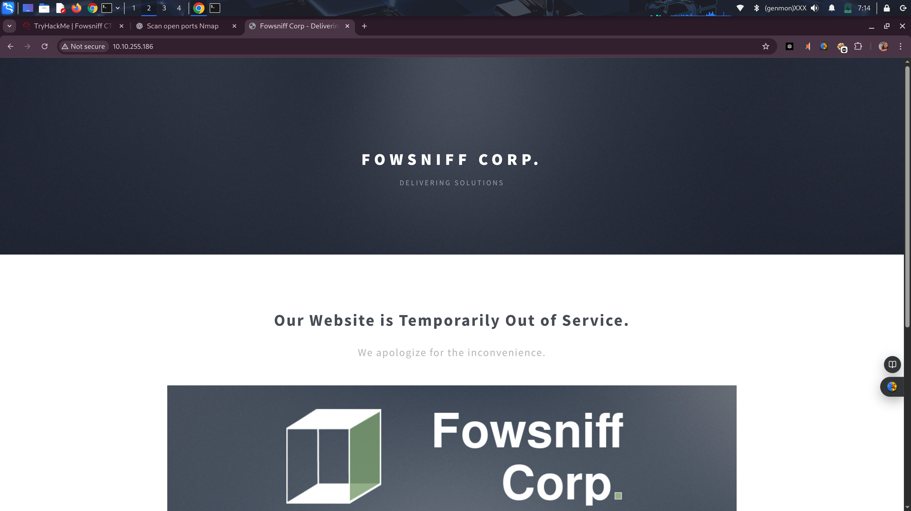
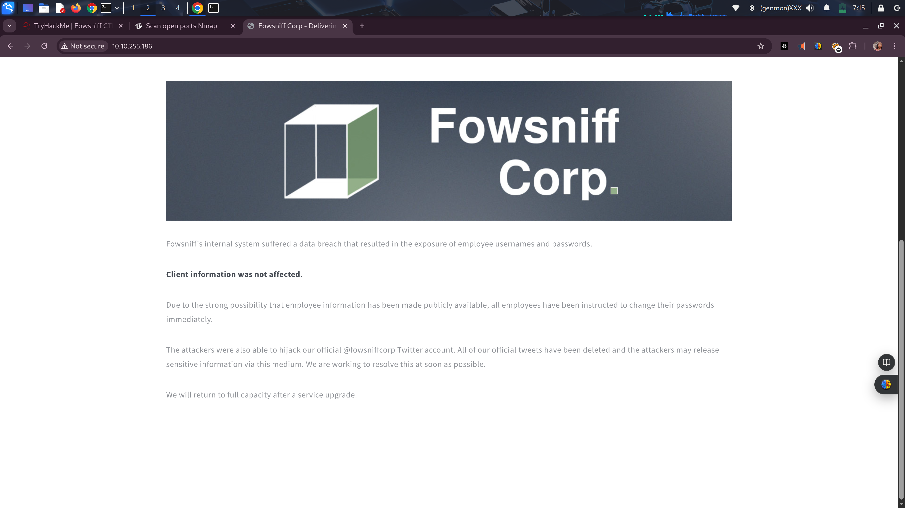
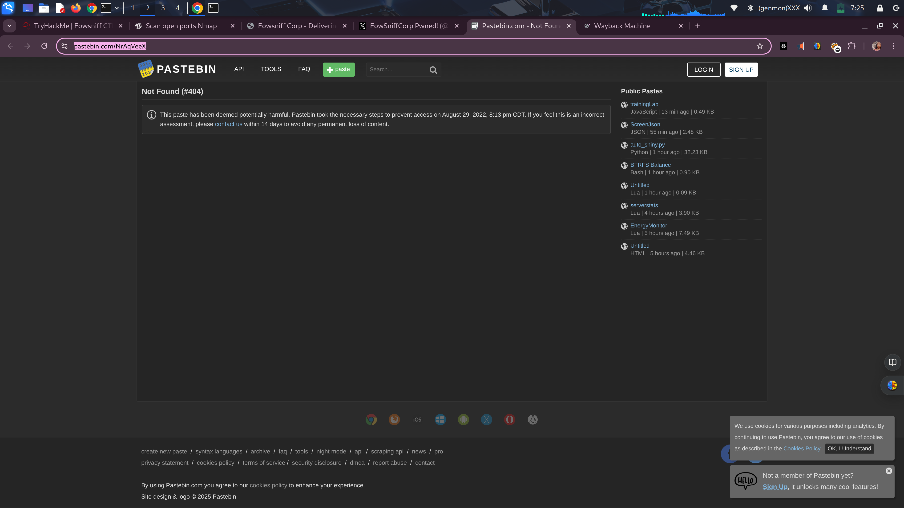
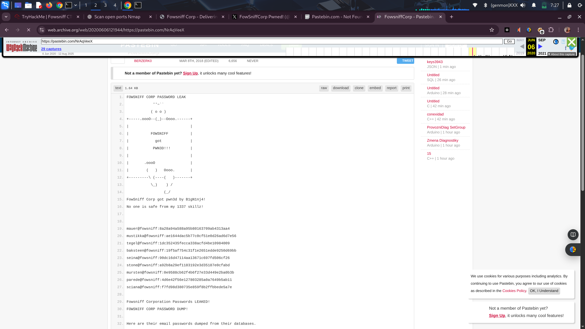

# fowsniff-tryhackme-challenge
a practical showcase of network enumeration, service fingerprinting, and exploiting weak authentication skills
---

## 🧠 Overview

This walkthrough documents the **Fowsniff** room on [TryHackMe](https://tryhackme.com/), focusing on enumeration, exploitation, and privilege escalation techniques used to compromise the vulnerable machine.

I enumerated open services like FTP and POP3, harvested credentials and files, used recovered credentials to pivot to SSH where possible, and performed privilege escalation to capture the root flag. This walkthrough records the commands I ran, findings, screenshots, and lessons learned for reproducible learning.

# Step 1 — Connect to TryHackMe (OpenVPN)

## Files & Preparation

1. **Download the .ovpn File**:
   - Navigate to the TryHackMe Access (or VPN) page and download the .ovpn file.

2. **Store the File**:
   - Place the .ovpn file in a convenient location, such as `~/vpn/tryhackme.ovpn`, for easy access when importing or running it.

## What This Does

- The OpenVPN profile establishes a secure tunnel between your machine and the TryHackMe lab network.

- **Keep the VPN Connection Active**: Ensure the VPN connection remains active for the entire duration of your engagement. Closing it will disconnect you from the lab machines.

## Verifying the Connection

1. **Check for VPN Interface**:
   - Verify that a VPN/tunnel network interface appears on your system, commonly named `tun0` or similar.

2. **Confirm Public IP**:
   - Ensure your public IP or routed address differs from your normal ISP-assigned IP, indicating that traffic is routed through the VPN.

3. **Test Connectivity**:
   - Test basic connectivity to the target machine specified in the room to ensure packets are reaching the lab.

## Notes / Tips

- **Using a GUI**:
  - If you prefer a graphical user interface, import the .ovpn file into your OS network manager (GNOME/KDE) and connect from the network menu.

- **Authentication Issues**:
  - If the VPN fails to authenticate or connect, re-download the .ovpn file from the TryHackMe Access page, as profiles can be user-specific or expire.

- **Maintain VPN Connection**:
  - Keep the VPN running throughout the exercise; it is required to access TryHackMe machines.****

# Step 2 — Network Scan (Nmap)

I scanned the target from my attacking machine using Nmap to discover open services and versions.

nmap -sV --open <target-ip>
# What the Command Does

- `-sV`: Probes open ports to determine the service name and version (service fingerprinting).
- `--open`: Shows only open ports, reducing noise in the output.
- `<target-ip>`: The IP address of the TryHackMe machine.

# Why I Ran This

To quickly identify which services are running (FTP, POP3, SSH, HTTP, etc.) and their versions so I know where to focus enumeration and exploitation efforts.

Service versions help pick the correct tools/techniques and identify known weak configurations.

# What I Looked For

- Open ports and corresponding services.
- Service versions that hint at vulnerabilities or known misconfigurations.
- Unusual or unexpected services that could indicate additional attack paths.
- Any banners or extra information (FTP welcome messages, HTTP titles) that might contain usernames, paths, or clues.

# Step 3 — Web Enumeration (Found Twitter Handle)

I visited the web page identified during my Nmap scan and discovered a reference to the machine owner's Twitter account.

## What I Found

- A visible link or mention on the site pointing to a Twitter handle (e.g., `@exampleuser`).
- The web page content included social links or an author/contact area that contained the Twitter information.

## Why This Matters

Social links often contain usernames that can be reused as login names across services (FTP, mail, SSH).

Public profiles may include email addresses, alternative usernames, or other breadcrumbs useful for enumeration or guessing credentials.

External profiles (Twitter, LinkedIn, GitHub) can reveal development habits, common password patterns, or private links accidentally posted.

**Note:** All actions were performed on the TryHackMe lab machine and resources. Do not probe or enumerate real people’s accounts or services without explicit authorization.

## Step 4 — OSINT: Twitter → Pastebin → Archive / Mirror Recovery

I visited the company’s Twitter page and found a tweet that referenced a now-removed Pastebin post. I used two parallel approaches to recover the missing content.

### What I saw
- A tweet linking to a Pastebin URL.
- The Pastebin post was removed (the direct link returned nothing).

### Approach A — Wayback Machine (archive lookup)
1. Searched the Internet Archive (Wayback Machine) for the exact Pastebin URL.
2. Navigated to the calendar snapshots and selected a capture from the date the tweet was posted.
3. Recovered the archived page content and saved a local copy for analysis and documentation.

### Approach B — Social Trail / Comment Mirrors
1. Reviewed replies and comments on the original tweet and found a user who reposted the same content or linked to an alternative location.
2. The comment contained a link to a GitHub repository / Gist where the breached information had been mirrored.
3. Followed that link, located the mirrored content, and saved a copy for analysis.

### Why Both Approaches Matter
- **Archives**: Recover content removed from the original host but still captured by crawlers.
- **Social Mirrors**: Often reproduce removed content and sometimes include added metadata (timestamps, usernames) that help reconstruct timelines.

Using both increases confidence in recovered data and provides redundancy.

## Step 5 — Dehashing MD5 Credentials

I found a list of usernames and passwords stored as MD5 hashes in the recovered files. I used an online MD5 de-hashing service to recover plaintext values and saved the results into separate files for usernames and passwords.

### What I Found
- A file (or snippet) containing username and password MD5 hashes.
- Hashes were clearly labelled or paired in the recovered content.

## Step 6 POP3 — brute-force (Metasploit)

I searched Metasploit for POP3 modules, selected the appropriate scanner, set the target and my wordlists, and ran the module to test the dehashed credentials.

### Goal
- Test recovered/dehashed credentials against the target POP3 service to verify validity and identify valid logins.

### Tools
- `msfconsole` (Metasploit Framework)
- Wordlists for usernames and passwords (e.g. `users.txt`, `passwords.txt`)

## Step 7 — POP3 Access — Validated Credentials & Manual Connection

During credential validation I confirmed a successful authentication for account **`seina`** with password **`scoobydoo2`** (discovered during the Metasploit scan). I used those credentials to manually connect to the target POP3 service using `nc`, specifying the company IP and the POP3 port discovered in our Nmap reconnaissance.

---

### What I did (concise)
1. Verified Metasploit-reported successful login for `seina` → `scoobydoo2`.
2. Reproduced the login manually to capture session banner, server responses, and to verify mailbox access.
3. Connection was made with `nc` (netcat) to the company IP and the POP3 port discovered in the Nmap scan.

---
## Step 8 — Mailbox Intelligence → SSH Pivot

I reviewed Seina’s mailbox and found a temporary password in one message. In a second message, a colleague’s casual comment (a nonchalant remark referencing “stones” in the thread) indicated the colleague had not followed the IT security instructions to change the temporary password after the breach. That suggested the temporary password might still be valid for the colleague’s account.

Using that insight I attempted to reuse the temporary password and successfully accessed the colleague’s account over SSH from my attacking machine.

