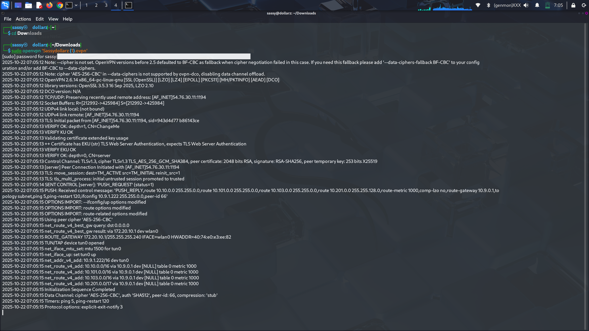
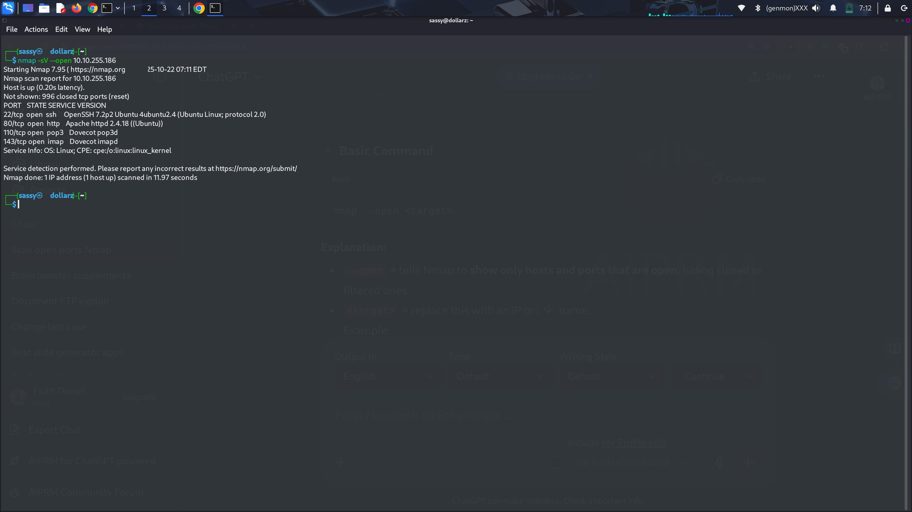

# fowsniff-tryhackme-challenge
a practical showcase of network enumeration, service fingerprinting, and exploiting weak authentication skills
---

## 🧠 Overview

This walkthrough documents the **Fowsniff** room on [TryHackMe](https://tryhackme.com/), focusing on enumeration, exploitation, and privilege escalation techniques used to compromise the vulnerable machine.

I enumerated open services like FTP and POP3, harvested credentials and files, used recovered credentials to pivot to SSH where possible, and performed privilege escalation to capture the root flag. This walkthrough records the commands I ran, findings, screenshots, and lessons learned for reproducible learning.

# Step 1 — Connect to TryHackMe (OpenVPN)

## Files & Preparation

1. **Download the .ovpn File**:
   - Navigate to the TryHackMe Access (or VPN) page and download the .ovpn file.

2. **Store the File**:
   - Place the .ovpn file in a convenient location, such as `~/vpn/tryhackme.ovpn`, for easy access when importing or running it.

## What This Does

- The OpenVPN profile establishes a secure tunnel between your machine and the TryHackMe lab network.

- **Keep the VPN Connection Active**: Ensure the VPN connection remains active for the entire duration of your engagement. Closing it will disconnect you from the lab machines.

## Verifying the Connection

1. **Check for VPN Interface**:
   - Verify that a VPN/tunnel network interface appears on your system, commonly named `tun0` or similar.

2. **Confirm Public IP**:
   - Ensure your public IP or routed address differs from your normal ISP-assigned IP, indicating that traffic is routed through the VPN.

3. **Test Connectivity**:
   - Test basic connectivity to the target machine specified in the room to ensure packets are reaching the lab.

## Notes / Tips

- **Using a GUI**:
  - If you prefer a graphical user interface, import the .ovpn file into your OS network manager (GNOME/KDE) and connect from the network menu.

- **Authentication Issues**:
  - If the VPN fails to authenticate or connect, re-download the .ovpn file from the TryHackMe Access page, as profiles can be user-specific or expire.

- **Maintain VPN Connection**:
  - Keep the VPN running throughout the exercise; it is required to access TryHackMe machines.****

# Step 2 — Network Scan (Nmap)

I scanned the target from my attacking machine using Nmap to discover open services and versions.

nmap -sV --open <target-ip>
# What the Command Does

- `-sV`: Probes open ports to determine the service name and version (service fingerprinting).
- `--open`: Shows only open ports, reducing noise in the output.
- `<target-ip>`: The IP address of the TryHackMe machine.

# Why I Ran This

To quickly identify which services are running (FTP, POP3, SSH, HTTP, etc.) and their versions so I know where to focus enumeration and exploitation efforts.

Service versions help pick the correct tools/techniques and identify known weak configurations.

# What I Looked For

- Open ports and corresponding services.
- Service versions that hint at vulnerabilities or known misconfigurations.
- Unusual or unexpected services that could indicate additional attack paths.
- Any banners or extra information (FTP welcome messages, HTTP titles) that might contain usernames, paths, or clues.

# Step 3 — Web Enumeration (Found Twitter Handle)

I visited the web page identified during my Nmap scan and discovered a reference to the machine owner's Twitter account.

## What I Found

- A visible link or mention on the site pointing to a Twitter handle (e.g., `@exampleuser`).
- The web page content included social links or an author/contact area that contained the Twitter information.

## Why This Matters

Social links often contain usernames that can be reused as login names across services (FTP, mail, SSH).

Public profiles may include email addresses, alternative usernames, or other breadcrumbs useful for enumeration or guessing credentials.

External profiles (Twitter, LinkedIn, GitHub) can reveal development habits, common password patterns, or private links accidentally posted.

## How I Documented It

- Took a screenshot of the web page showing the Twitter handle.
- Saved the URL and the exact handle text in my notes (`/notes` folder).
- Added the handle to my list of usernames to test against discovered services.

## Follow-up Actions

- Check the Twitter profile for publicly visible email, bios, or links to other accounts.
- Use the username as a potential login when attempting service authentication (carefully and ethically, within the lab).
- Correlate any names/emails found with files or banners downloaded from services (FTP, POP3) to look for credential reuse.

**Note:** All actions were performed on the TryHackMe lab machine and resources. Do not probe or enumerate real people’s accounts or services without explicit authorization.
